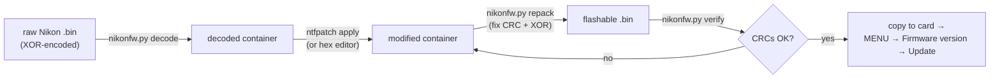

# Modding D800E firmware: decode → patch → re-encrypt → verify

Everything needed to turn the shipping Nikon image into an editable file and back
into a flashable one, using only `re/nikonfw.py` (no proprietary tools, no Windows).

## 1. Container format

The file Nikon distributes (`D800E_0111.bin`) is a small container with two
firmware blocks, XOR-obfuscated:

```
offset       size        content
0x000000    0x20        header (space-padded text around 0x20)
0x000020    4           u32 BE block count (2)
0x000024    up to 0x30  header padding
0x000030    count*32    block entries, 32 bytes each:
                          +0x00  name[16]  ASCII, zero-padded   "a63em011100.bin"
                          +0x10  offset u32 BE                 block start in file
                          +0x14  length u32 BE                 block length in file
0x000070    0x100002    block 0: A firmware   (a63em011100.bin)
0x100072    0x0E2000    block 1: B firmware   (b63e111b.bin)  <- patches live here
```

Every block ends with a **CRC16-CCITT** (poly `0x1021`, init 0) over all bytes of
the block except the last two; the CRC is stored **big-endian** in the last 2 bytes.
The whole file is then **XOR-encoded** with three 256-byte tables indexed by
`i & 0xFF`, `(i>>8) & 0xFF`, `(i>>16) & 0xFF`. XOR is an involution: the same
operation decodes and encodes.

Address mappings used throughout the repo:

| | formula |
|---|---|
| FR *memory* address (disassembly) | `B-block file offset + 0x40000` |
| *container* offset | `B-block file offset + 0x100072` |

## 2. Tools

`re/nikonfw.py` (stdlib only):

| command | purpose |
|---|---|
| `info <file>` | auto-detect state, print container entries |
| `decode <file> <out>` | produce the decoded container from any form |
| `encode <file> <out>` | produce the XOR-encoded (flashable) form |
| `extract <file> <idx> <out>` | pull one block (0 = A fw, 1 = B fw) |
| `search <file> <text>` | substring search in decoded data |
| `verify <file>` | check every block CRC (exit 1 on failure) |
| `repack <file> <out>` | **mod workflow**: fix all block CRCs, re-encrypt, write flashable image |

`re/patchcli/nfpatch` (native C, same patch database as NikonHacker):

```
nfpatch list  <raw_nikon.bin>
nfpatch apply <raw_nikon.bin> <out.bin> <patch_id> [patch_id...]
```

`nfpatch` hashes the **raw Nikon file** (D800E 1.11 = md5 `1b033eb7...`) and
handles XOR decoding/encoding itself. Patch id 57 is the D800E 1.11 set:

| id | level | what |
|---|---|---|
| 1 | Alpha | 1080p HQ 36 Mbps, NQ = old HQ |
| 2 | Alpha | 1080p HQ 54 Mbps, NQ = old HQ |
| 3 | Alpha | 1080p HQ 64 Mbps, NQ = old HQ |
| 4 | Alpha | 1080p HQ 64 Mbps, NQ 36 Mbps |
| 5 | Alpha | **720p60/50** HQ 64/60 Mbps, NQ 24/20 Mbps (this repo) |
| 6 | Alpha | **720p30/25** HQ 24/20 Mbps, NQ 12/10 Mbps (this repo) |

Ids combine, e.g. `nfpatch apply stock.bin out.bin 3 5 6` = full 64 Mbps mod.
Or use the one-command wrapper, which also verifies CRCs and names the output:

```sh
./re/make-mod.sh <raw D800E_0111.bin> <outdir> 3 5 6
# -> <outdir>/D800E_0111.bin, sha256 printed, CRC-verified
```

After flashing, confirm the patch took by measuring a recorded clip:

```sh
./nikon-check-bitrate.sh --from-camera <file_index>   # or: ./nikon-check-bitrate.sh clip.MOV
```

## 3. The mod loop



`repack` refuses to write if fixing the CRC is not stable (it re-computes twice and
compares), so a corrupted edit cannot silently produce a bad image.

## 4. Worked example: extend the bitrate patch to 720p60

The stock alpha patch only boosts the three 1080p modes. From the disassembly
(`d800e/ENCODE-MODULE.md`), 720p60 HQ/NQ live at B-block file offsets
`0x021F38/0x021F3E` (24/20 Mbps) and `0x021F4C/0x021F52` (12/10 Mbps), i.e.
container offsets `+0x100072`:

```sh
python3 re/nikonfw.py decode firmware/.../D800E_0111.bin /tmp/fw.dec
python3 - <<'EOF'
import struct
d = bytearray(open("/tmp/fw.dec","rb").read())
BASE = 0x100072                      # B block start in the container
for off, val in {0x21F38: 64_000_000, # 720p60 HQ   -> 64 Mbps
                 0x21F3E: 60_000_000, # 720p60 HQ2  -> 60 Mbps
                 0x21F4C: 24_000_000, # 720p60 NQ   -> 24 Mbps
                 0x21F52: 20_000_000}.items():  # NQ2 -> 20 Mbps
    struct.pack_into(">I", d, BASE + off, val)
open("/tmp/fw.mod","wb").write(d)
EOF
python3 re/nikonfw.py repack /tmp/fw.mod /tmp/fw.flashable.bin
python3 re/nikonfw.py verify /tmp/fw.flashable.bin
```

The same works for 720p50 (`0x21FB0/0x21FB6`, `0x21FC4/0x21FCA`),
720p30 (`0x21F64/0x21F6A`, `0x21F78/0x21F7E`) and
720p25 (`0x21FDC/0x21FE2`, `0x21FF0/0x21FF6`).
All sites are u32 big-endian bits/second. See `d800e/ENCODE-MODULE.md` for the
full mode map and the safe ranges to stay inside.

## 5. Rebuilding the native patcher with new patch entries

`re/patchcli/` vendors the NikonHacker patch database:

- `patches.c` – one `struct Patch` per selectable option, each with a
  `struct Change` list: `CHANGE(blocks, file_offset, before[], after[])`.
  `file_offset` is the **B-block file offset** (see mapping above), and the
  `before[]` guard makes a mismatched firmware fail loudly.
- `patches.h` – `PatchMap[]` pairs an md5 with a `PatchSet`
  (D800E 1.11 = id 57, md5 of the raw Nikon download).
- `build.sh` – clones upstream at a pinned commit, applies
  `re/d800e_0111_patches.diff`, builds `nfpatch`.

To add an option: append `Change` entries (with stock `before` bytes), add the
`struct Patch`, extend `D800E_0111_patches[]`, rebuild, then
`nfpatch apply <raw> <out> <id...>`.

Worked example in this repo: `re/d800e_0111_patches.diff` contains both the
original 1080p port (ids 1-4) and the 720p extension (ids 5-6, 32 `Change`
entries using the offsets from `d800e/ENCODE-MODULE.md` section 8). Regenerate
the diff after editing the patched `patches.c` with
`diff -u --label tools/nikon-firmware-tools/Nikon-Patch-JS/src/nikon_patch/patches.c --label patchcli/patches.c <pristine> <patched>`.

## 6. Safety notes

- Flashing is still Alpha-risk: there is no DIY recovery on a bricked D800/D800E
  (mainboard swap or chip-off NAND reflash only). See
  `../FIRMWARE-PATCH-RESEARCH.md`.
- `repack`/`verify` guarantee the container is structurally correct (CRCs, XOR);
  they cannot guarantee the camera accepts a given byte change. Change one thing
  at a time and keep the stock file to re-flash.
- The stock raw file's sha256 is
  `8209dd3a57fbc0f5dbc50683aae9daefee60fec016c2afcd43ebc26b9ff0a9c0`;
  the shipped 64 Mbps variant produced by `nfpatch` id 3 has
  `9de3c24ae5f08eb93b94344a7f53bc3dc1824a52f8bb947dc299d2e1784b75d8`.
