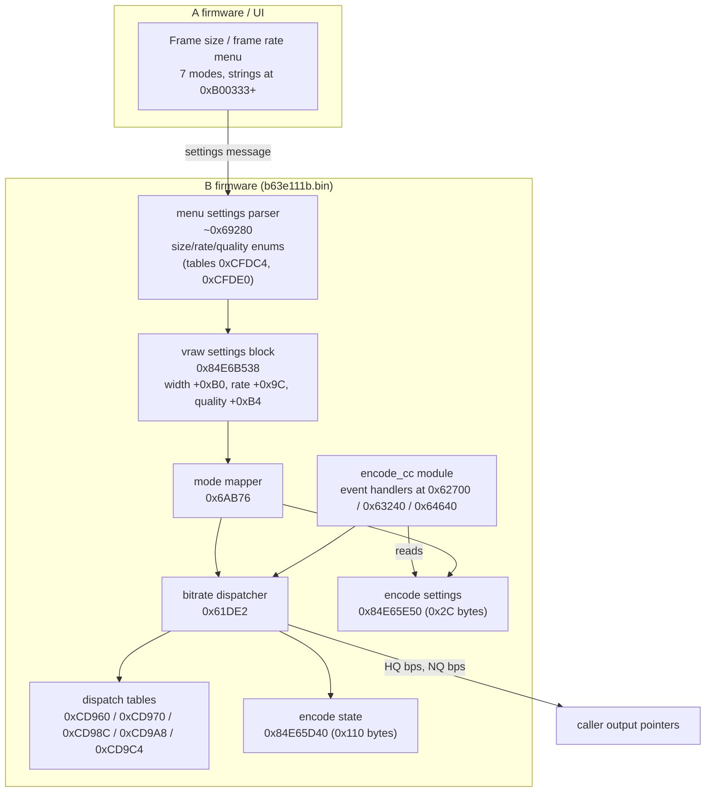
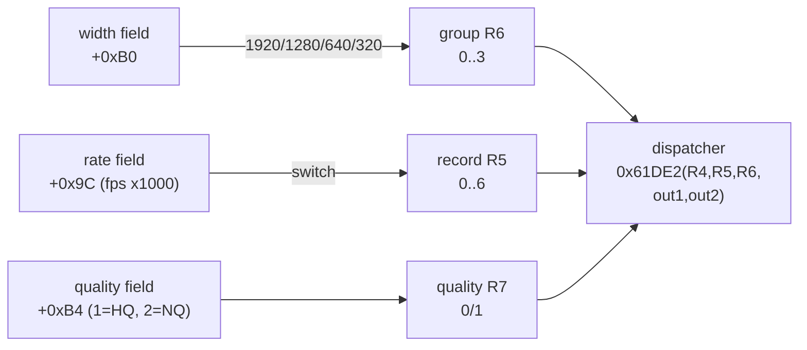
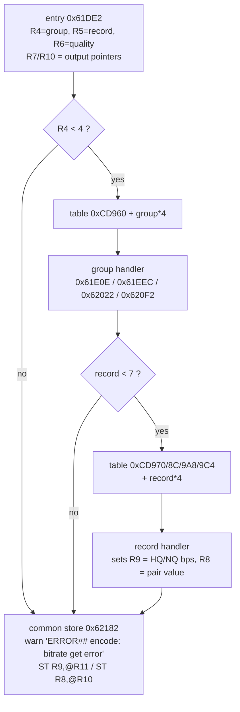
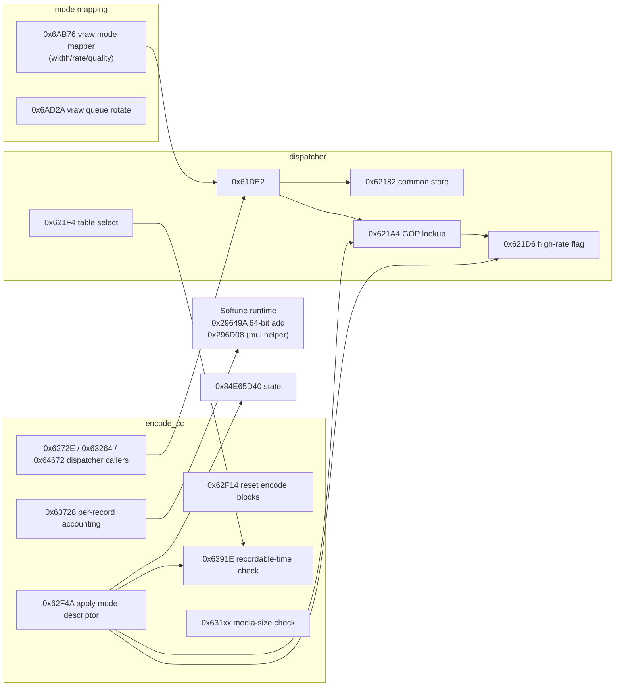

# The D800E movie encode module, mapped (B firmware 1.11)

Visual reference for the code that turns a movie-menu selection into encoder
bitrates. Addresses are FR memory addresses; **file offsets = memory - 0x40000**
(B block), **container offsets = file offset + 0x100072** (see `../MODDING.md`).

## 1. The big picture

## 2. Mode selection → (group, record, quality)

`0x6AB76` (vraw module) reads the current movie settings from the vraw context
`0x84E6B538` and maps them:

### Record index = frame-rate class

| rate field `[0x9C]` | fps | record | notes |
|---|---|---|---|
| 24000 | 24p | 0 | |
| 60000 | 60p | 1 | `0x621D6` flag = 1 |
| 30000 | 30p | 2 | |
| 15000 | 15p | 3 | non-movie pipe |
| 2400 | 2.4p | 4 | non-movie pipe |
| 50000 | 50p | 5 | `0x621D6` flag = 1 |
| 25000 | 25p | 6 | |

### Group = frame-size class (from `0x630A0`)

| group | plane constant | encoder dims | menu dims (parser table 0xCFDE0) |
|---|---|---|---|
| 0 | 0x1F6800 (2,058,240 B) | 1920x1072 | 1920x1080 |
| 1 | 0x0DC000 (901,120 B) | 1280x704 | 1280x720 |
| 2 | 0x041000 (266,240 B) | 640x416 | 640x424 |
| 3 | 0x020800 (133,120 B) | 640x208 | 320x216 |

### Menu enum tables (settings parser entry `0x692A0`)

Parser entry is `0x692A0`: it clears 0x154 bytes of `0x84E6B538`, copies a name
string from `0xCFBC0`, clamps/copies audio strings, stores arg2 at `ctx+0x90`, then
fills the fields below from the source struct. It is called from **`0x70C7A`**, the
"prepare movie pipeline" function (entry confirmed by the call at `0x6DA2C`; its
internal jumps use table `0xD0B6C`). That function switches on the *size enum*,
computes encoder buffer geometry (1920x1080/1088, 1280x720, 640x424/480,
320x216/480 with rounding math) and builds the stack message passed to the parser.
Its caller `0x6DAxx` runs after REALOS services (`INT #0x40`) and passes
`R4 = [0x84E6BFD4]` - a control word in the shared RAM block. A getter at `0x69290`
returns the ctx pointer; `0x6922A` converts time values (÷1000).

The parser copies the movie-settings message into the vraw context. Its jump tables
are the authoritative enum orders:

**rate enum** (table `0xCFDC4`, source field `+0x14`) — this *is* the record order:

| enum | timebase | scale | real rate | class |
|---|---|---|---|---|
| 0 | 24000 | 1001 | 23.976 | 24p |
| 1 | 60000 | 1001 | 59.940 | 60p |
| 2 | 30000 | 1001 | 29.970 | 30p |
| 3 | 15000 | 1001 | 14.985 | 15p (non-menu) |
| 4 | 2400 | 100 | 24.000 | 24p-exact (non-menu) |
| 5 | 50000 | 1000 | 50.000 | 50p |
| 6 | 25000 | 1000 | 25.000 | 25p |

Rate = timebase / scale. The `(2400, 100)` pair is **24.000 fps exactly** (integer-rate
variant, distinct from the 23.976 movie mode at `(24000, 1001)`); `(15000, 1001)` is
14.985 fps (29.97/2). Neither is in the movie menu - they serve non-movie pipelines
driven from outside the B image (records 3/4).

**size enum** (table `0xCFDE0`, source field `+0x10`):

| enum | width | height |
|---|---|---|
| 0 | 1920 | 1080 |
| 1 | 1280 | 720 |
| 2 | 640 | 424 |
| 3 | 320 | 216 |

Other source fields: `+0x18` quality (0 unset, 1 = High, 2 = Normal),
`+0x1C` audio flag, `+0x20` sample rate (48000/24000/44100), `+0x28` audio depth
(1 = 8-bit, 2 = 16-bit). The NTSC pulldown bases explain the x1001 scaling seen in
the `0x63728` accounting increments (360,360 = 360 x 1001).

### The 7 movie modes

| UI mode | width | rate | group | record | HQ pair (quality=0) | NQ pair (quality=1) | alpha patch |
|---|---|---|---|---|---|---|---|
| 1920x1080; 30p | 1920 | 30000 | 0 | **2** | 24/20 Mbps | 12/10 Mbps | **yes** |
| 1920x1080; 25p | 1920 | 25000 | 0 | **6** | 24/20 Mbps | 12/10 Mbps | **yes** |
| 1920x1080; 24p | 1920 | 24000 | 0 | **0** | 24/20 Mbps | 12/10 Mbps | **yes** |
| 1280x720; 60p | 1280 | 60000 | 1 | **1** | 24/20 Mbps | 12/10 Mbps | no |
| 1280x720; 50p | 1280 | 50000 | 1 | **5** | 24/20 Mbps | 12/10 Mbps | no |
| 1280x720; 30p | 1280 | 30000 | 1 | **2** | 12/10 Mbps | 8/6 Mbps | no |
| 1280x720; 25p | 1280 | 25000 | 1 | **6** | 12/10 Mbps | 8/6 Mbps | no |

This is why the 12-site alpha patch (group 0, records 0/2/6) exactly covers the three
1080p modes, and why 720p60/50 already run at 24 Mbps but were left untouched.

## 3. The dispatcher (0x61DE2)

Quality comes in as R6 and is remapped to the internal R5; **quality 0 = High**
(first handler pair), **quality 1 = Normal** (second pair).

## 4. Definitive bitrate matrix (mechanically extracted)

Values are decimal Mbps; `@` = **B-block file offset** of the u32 BE operand.
Records are frame-rate classes (0=24p, 1=60p, 2=30p, 3=15p, 4=2.4p, 5=50p, 6=25p).

### Group 0 — 1920-wide (1080p)

| rec | pair A | pair B | patched sites (A) | patched sites (B) |
|---|---|---|---|---|
| 0 (24p) | 24 / 20 | 12 / 10 | 0x21E2E, 0x21E34 | 0x21E42, 0x21E48 |
| 1 (60p) | — none — | | | |
| 2 (30p) | 24 / 20 | 12 / 10 | 0x21E5A, 0x21E60 | 0x21E6E, 0x21E74 |
| 3 (15p) | 12 / 8 | 12 / 8 | 0x21E82, 0x21E88 | |
| 4 (2.4p) | 12 / 8 | 12 / 8 | 0x21ECE, 0x21ED4 | |
| 5 (50p) | — none — | | | |
| 6 (25p) | 24 / 20 | 12 / 10 | 0x21EA6, 0x21EAC | 0x21EBA, 0x21EC0 |

The A block (0x21E2E…0x21EC0) is the upstream patch's 12 sites: 24/20 -> 64/60 for
HQ and 12/10 -> 24/20 for NQ.

### Group 1 — 1280-wide (720p)

| rec | pair A | pair B | sites A | sites B |
|---|---|---|---|---|
| 0 (24p) | 10 / 8 | 6 / 5 | 0x21F0C, 0x21F12 | 0x21F20, 0x21F26 |
| 1 (60p) | 24 / 20 | 12 / 10 | 0x21F38, 0x21F3E | 0x21F4C, 0x21F52 |
| 2 (30p) | 12 / 10 | 8 / 6 | 0x21F64, 0x21F6A | 0x21F78, 0x21F7E |
| 3 (15p) | 9 / 6 | 9 / 6 | 0x21F8C, 0x21F92 | |
| 4 (2.4p) | 9 / 6 | 9 / 6 | 0x22004, 0x2200A | |
| 5 (50p) | 24 / 20 | 12 / 10 | 0x21FB0, 0x21FB6 | 0x21FC4, 0x21FCA |
| 6 (25p) | 12 / 10 | 8 / 6 | 0x21FDC, 0x21FE2 | 0x21FF0, 0x21FF6 |

### Groups 2 and 3 — small pipelines (640/320-wide)

All roughly 6/4 → 3/2 Mbps; not user-selectable movie modes. Their handler set is at
0x6203C…0x62170 (files 0x2203E…0x22178).

## 5. Per-record helper data

| helper | table | meaning |
|---|---|---|
| `0x621A4(record)` | 0xCD9E0 | GOP length in frames ≈ fps/2: `[12, 30, 15, 15, 12, 24, 12]` for records 0..6 |
| `0x621D6(record)` | 0xCD9FC | `1` for records 1 and 5 (60p/50p), else 0 – high-rate flag |
| `0x621F4(g, rec, q)` | – | returns `0x124F80` for q=0 with (g=0) or (g=1, rec in {1,5}); else `0x1B7358` |
| `0x63728` record cases | 0xCDA6C | **time accounting**: per record adds `360000/fps` to a 64-bit accumulator via Softune `0x29649A` (64-bit add). Increments (table order, corrected): rec0..6 = `15015, 6006, 12012, 24024, 15000, 7200, 14400`; `increment x real fps = 360,000` exactly for **all seven** records, i.e. the accumulator is a **360 kHz timebase** (1/360000 s units) |
| `0x64640` batch cases | 0xCDAA4 | **bytes-per-GOP** budget: `(bitrate >> 3) x GOP / floor(fps)` where floor(fps) per record = `23, 59, 29, 14, 24, 50, 25` (division via `0x296D08`) |

`0x636C6`/`0x64C24(record, out_num, out_den)` returns the `(timebase, scale)` pair for a
record - the same table as the settings parser, used to fill `[D40+0x2C/+0x30]` ("video
timescale", error string `0xCD554`). `0x64C1A` writes `[E50+0x38] = R4`.

## 6. Data structures

### 0x84E65E50 — encode settings (0x2C bytes)

| offset | meaning | B-side access |
|---|---|---|
| +0x04 | request/channel id (copied to +0x38 by `0x63134`) | read |
| +0x08 | total time (checked against 1000 → "total_time too small") | read |
| +0x0C | command/state setter arg | write `0x62D8E` |
| +0x10 | group (frame-size class 0..3) | read only |
| +0x14 | record (rate class 0..6) | read only |
| +0x18 | quality (0=HQ, 1=NQ) | read only |
| +0x1C | flag checked at encode start | read |
| +0x28 | copied from mode descriptor by `0x62F4A` | write (apply) |
| +0x38 | copy of +0x04 | write `0x64C1A` |

**No B-firmware code writes `+0x08/+0x10/+0x14/+0x18`** - all ten E50 base references
were inspected: they read the mode fields (dispatcher callers, checks) or write only
state fields (`0x62F14` reset memsets the block, `0x62D8E`, `0x64C1A`). Conclusion:
the movie mode triple arrives from the **other CPU** (the A image `a63em011100.bin`
contains no FR code/strings) via shared RAM/IPC; B only consumes it. The same is true
for the settings-parser input (section 2).

### 0x84E65D40 — encode state (0x110 bytes)

| offset | meaning |
|---|---|
| +0x00 | derived time value (result of `0x67E86`) |
| +0x04 | GOP length from `0x621A4` |
| +0x08 / +0x0C | media free space vs required (0x100400/0x100800) → "vacant media size too small" |
| +0x10 | recordable time |
| +0x14 | compared in `0x6391E` → "recordable time max over" |
| +0x1C..+0x28 | force-stop / watchdog state flags |
| +0x3C | sequence counter (0x84E65D3C) |
| +0x48..+0x8F | two 10-entry u32 arrays, zeroed at start |
| +0x110 | end (reset by `0x62F14`) |

### 0x84E6B538 — vraw context

| offset | meaning |
|---|---|
| +0x90 | read by 0x6AB76 |
| +0x9C | rate (fps x1000, see table) |
| +0xB0 | frame width (1920/1280/640/320) |
| +0xB4 | quality menu value (1=High, 2=Normal) |
| +0xB6 | audio-present flag |
| +0xB8/+0xBA/+0xBC | audio config (depths 8/16; rates 0xBB80=48000, 0x5DC0=24000, 0xAC44=44100) |
| +0x140 | counter incremented per request |
| +0x144/+0x148 | running flag + duration |
| +0x14C/+0x150 | cleared / computed audio rate |
| +0x270 | 32-entry u32 queue copied from +0xC0 by `0x6AD2A` |

A second vraw block at 0x84E6B4B8 receives the 32-entry queue.

## 7. Function map

`0x62F4A` (apply mode descriptor) and `0x62F14` (reset) have **no direct LDI
references** – they are entered indirectly (pointer table), still open. `0x67854`
is the shared memset.

## 8. Extension map (safe, mode-scoped bitrate changes)

All values are u32 BE bits/s at B-block file offsets (container offset =
+0x100072). To mirror the 1080p patch on the other modes:

| mode | HQ pair A | HQ pair B | NQ pair A | NQ pair B |
|---|---|---|---|---|
| 1080/24p | 0x21E2E | 0x21E34 | 0x21E42 | 0x21E48 |
| 1080/30p | 0x21E5A | 0x21E60 | 0x21E6E | 0x21E74 |
| 1080/25p | 0x21EA6 | 0x21EAC | 0x21EBA | 0x21EC0 |
| 720/60p | 0x21F38 | 0x21F3E | 0x21F4C | 0x21F52 |
| 720/50p | 0x21FB0 | 0x21FB6 | 0x21FC4 | 0x21FCA |
| 720/30p | 0x21F64 | 0x21F6A | 0x21F78 | 0x21F7E |
| 720/25p | 0x21FDC | 0x21FE2 | 0x21FF0 | 0x21FF6 |

The stock alpha patch rewrites the first three rows (HQ 24/20 → 64/60,
NQ 12/10 → 24/20). Patch with `../MODDING.md` and always flash a `verify`-clean file.

## 9. Remaining unknowns (small)

- The **A-side processor** that writes the shared control blocks (E50 mode triple,
  `0x84E6BFD4`, `0x84E6BED0`, `0x84E6BFC4`, `0x84E6C004`) is not FR code (the A image
  has 0 FR `RET` patterns, a `3c 1a bf c0` header and a Nikon copyright string at
  `0x7FB8`); it cannot be disassembled with the FR toolchain. All B-side uses of
  those blocks are reads.
- Consumer side is now identified as the **spool/scheduler** subsystem
  (`0x6Dxxx-0x71xxx`): `0x6D340` divides accumulated time by 1000 (ms), bumps
  counters at `0x84E6C014`, keeps min/max at `0x84E6BA70/+4`; `0x6D29A` classifies
  intervals (clamped to 1000) into rate categories. Which visible UI element uses the
  result (remaining-time estimate vs. throttling) is not proven.
- Which non-movie pipeline uses the 15p (14.985 fps) and 24.000 fps classes.
